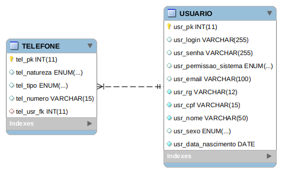

# Créditos:

Este projeto teve como principais desenvolvedores [Weslei de Paula Pinto](https://github.com/magaum) e [Felipe Menino](https://github.com/M3nin0), com o auxílio de [Carlos Neto](https://github.com/augustoliks).


# Objetivo: 

Criar uma API RESTful para seus serviços. A API deve contar com, pelo menos:

1. Uma rota para cadastro, que recebe um JSON e cadastra um registro. Em caso
   de erro, deve ser retornado um Status de erro apropriado;
2. Uma rota que retorna um registro, por meio de seu ID, em formato JSON e
   XML. Utilizar JSON View para não retornar o atributo ID; e
3. Uma rota que permite uma consulta aos registros criados. Essa rota deve
   obrigatoriamente poder retornar mais de um registro e deve receber mais de
   um parâmetro de busca. Utilizar JSON View para não apresentar alguns dos
   atributos (o ID deve ser apresentado).

Todos os requisitos foram desenvolvidos na classe [UsuarioController.java](src/main/java/br/org/celiolemos/controller/UsuarioController.java).

## Requisito 1

O método `public ResponseEntity<?> adicionaUsuario(@Valid @RequestBody Usuario usuario)` atende este requisito.

### Modelo do JSON


```javascript

{

	"cpf": "String",
	"dataNascimento": "dd/MM/yyyy",
	"email": "String",
	"login": "String",
	"nome": "String",
	"permissao": "admin / viewer ou editor",
	"rg": "String",
	"senha": "String",
	"sexo": "Masculino",
	"telefones": [
	    {
		"natureza": "Pessoal ou Profissional",
		"numero": "String",
		"tipo": "Residencial ou Movel"
	    }
  	]

}

```

URL: /usuarios

Método: `POST`


## Requisito 2

O método `public ResponseEntity<?> perfilUsuario(@PathVariable @NonNull Integer id)` atende este requisito.

Este método possui a anotação `@JsonView(View.UsuarioSemIdESenha.class)`, que faz com que todos os parâmetros que possuam esta anotação sejam enviados na resposta.

Todas as URLs da aplicação retornam XML ou JSON, isto pode ser configurado no header da requisição conforme exemplo abaixo:

curl -X GET "http://url:porta/usuarios" -H "accept: application/xml"

curl -X GET "http://url:porta/usuarios" -H "accept: application/json"

A configuração do retorno é feita com a anotação: `@RequestMapping`, esta anotação possui o parametro **produces** que define o retorno que é enviado pela aplicação. Caso nenhuma configuração seja enviada na requisição o retorno padrão é o primeiro parâmetro da anotação, veja que no exemplo abaixo o retorno padrão é JSON.

`@RequestMapping(path = "usuarios", produces = { MediaType.APPLICATION_JSON_VALUE, MediaType.APPLICATION_XML_VALUE })`

Esta anotação realiza o binding no caminho relativo /usuarios e define que a aplicação retorna JSON e XML nas respostas.

URL: /usuarios/{id}

Método: `GET`

## Requisito 3

O método `public ResponseEntity<?> filtrar(@RequestParam Sexo sexo, @RequestParam Permissao permissao)` atende este requisito.

Este método oculta os parâmetros informados na *query string*, já que estes são conhecidos no momento da requisição.

URL: /usuarios/procurar?sexo=?&permissao=?

Parametros: 

* sexo
  * Masculino
  * Feminino
* permissao
  * admin
  * viewer
  * editor

Método: `GET`

## Banco de dados

A estrutura do banco de dados utilizado nesta aplicação pode ser vista abaixo


